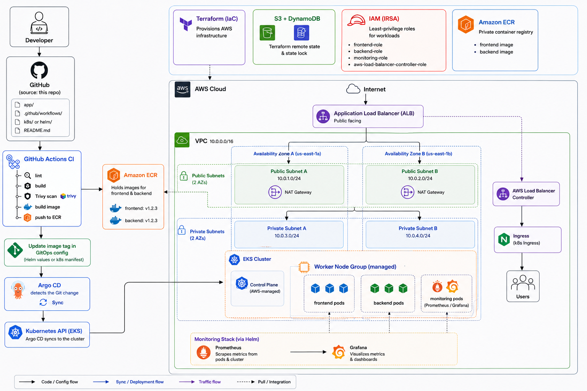

# three-tier-eks-iac
- this project 
## Structure 


---

## Flow 

```
Developer
   │
   ▼
GitHub (source: this repo)
   │
   ▼
GitHub Actions CI  ──▶  lint / build / Trivy scan / build image / push to ECR
   │
   ▼
Update image tag in GitOps config (Helm values or k8s manifest)
   │
   ▼
Argo CD detects the Git change  ──▶  Sync  ──▶  Kubernetes API (EKS)
   │
   ▼
EKS cluster (provisioned by Terraform)
   │
   ├── Frontend Deployment + Service
   ├── Backend Deployment + Service
   ├── MongoDB (StatefulSet)
   ├── AWS Load Balancer Controller → ALB → Ingress → users
   └── Prometheus + Grafana (via Helm) → scrape metrics from pods & cluster
```
**AWS structure**
```
Internet
   │
   ▼
Application Load Balancer (public subnet)
   │
   ▼
VPC
 ├── Public subnets  (2 AZs) — NAT Gateway, ALB
 └── Private subnets (2 AZs) — EKS worker nodes
        └── EKS
             ├── Control plane (AWS-managed)
             └── Worker node group
                  ├── frontend pods
                  ├── backend pods
                  └── monitoring pods (Prometheus/Grafana)

ECR ── holds frontend & backend images
IAM ── IRSA roles scoped per-service (least privilege)
S3 + DynamoDB ── Terraform remote state + lock
```
---

**repo structure**
```
three-tier-eks-iac/
├── app/              
│   ├── backend/
│   │   └── Dockerfile 
│   └── frontend/
│       └── Dockerfile
├── terraform/
│   ├── modules/        
│   └── environments/dev/
├── kubernetes/          
├── helm/                 
├── argocd/   
├── monitoring/
├── .github/workflows/
├── docs/    
└── README.md
```